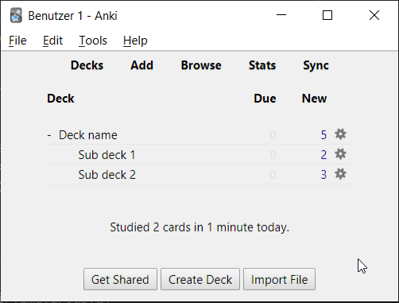

# Ankithon


Convert markdown documents to [anki](https://apps.ankiweb.net/) flashcards with this simple python script. 

This fork is powered by [python-markdown2](https://github.com/trentm/python-markdown2) and [genanki](https://github.com/kerrickstaley/genanki) all with the usage of `uv`

## Features

- Include images
- Markdown image size specifiers
- Tables
- All the basic markdown syntax
    - Bullet Lists
    - Numbered Lists ...
- Style flashcards with CSS

## Usage

```
uv run main.py .\example\example.md
```

Other:

```
usage: uv run main.py [-h] [-o OUTPUT] [-s STYLE] INPUT

Convert markdown to anki deck.

positional arguments:
  INPUT                 Input *.md path.

optional arguments:
  -h, --help            show this help message and exit
  -o OUTPUT, --output OUTPUT
                        Output *.apkg path.
  -s STYLE, --style STYLE
                        CSS card style path.
  -q, --questions       Create *_questions.md with stripped answers.
  -w, --web             Create *.html document.
```

## Dependencies

`ankithon` depends on `markdown2` and `genanki`. Which is managed with `uv`, this tool can be installed [with this simple method](https://docs.astral.sh/uv/getting-started/installation/).

If you don't want to use `uv` (which is recommended) you can install them with `pip`

```
pip install genanki
pip install markdown2
```

## Example

Turn this:

```markdown
# Deck name

## Sub deck 1

### A card question?

An answer!

### Another card question?

Another answer... _With an image!_


## Sub deck 2

### Can you use tables?

- Yes!

| This is | a  | table    |
|---------|----|----------|
| This    | is | great!   |
| This    | is | amazing! |
| This    | is | ok!      |

### Bullet-Points?
- Example A
- Example B

### Numbered Lists?
1. Example A
2. Example B
3. Example C
```

Into this:



More examples in the `example/` directory of this repository.

## CSS styling.

CSS can be added using the `-s PATH/TO/STYLE.css` parameter.
CSS with the filename `style.css` in the same folder as the markdown file will be applied automatically.

Most markdown CSS should work as expected. For example this [github markdown](https://github.com/sindresorhus/github-markdown-css).
